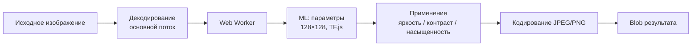

# Browser Image Enhancer

Система улучшения изображений **в браузере пользователя**: обученная нейросеть (TensorFlow.js) подбирает параметры **яркости**, **контрастности** и **цветности (насыщенности)**; детерминированный алгоритм применяет их ко всему кадру. Тяжёлая работа выполняется в **Web Worker**, интерфейс не блокируется.

---

## Соответствие требованиям

| Требование | Реализация |
|------------|------------|
| Современные браузеры | Chrome, Firefox, Edge, Safari 16+ (ES2022, Workers, OffscreenCanvas) |
| Объём кода ≤ 10 МБ | Бандл с TF.js ~3 МБ + worker ~1.6 МБ (минифицировано), gzip ~0.6–1 МБ на чанк |
| До 15 Мпк | Проверка при декодировании (`MAX_MEGAPIXELS`) |
| До 30 с на изображение | Таймаут задачи (`MAX_PROCESSING_MS = 30_000`) |
| Среднее ~5 с | Достижимо после прогрева TF.js; зависит от разрешения и CPU |
| JPG, PNG, HEIC, BMP | `src/utils/imageDecode.ts`, HEIC через `heic2any` |
| Асинхронный режим | API задач + Web Worker |
| API: постановка / статус / отмена / результат | Класс `ImageEnhancer` |

---

## Как это работает



1. **Декодирование** (главный поток): `File` / `Blob` / `ArrayBuffer` → `ImageBitmap` → `ImageData`; лимит 15 Мпк; HEIC конвертируется в растровый формат.
2. **Анализ** (worker): превью 128×128 подаётся в CNN; на выходе три числа в диапазоне **[-1, 1]** — `brightness`, `contrast`, `saturation`.
3. **Обработка** (worker): полосовое прохождение по `ImageData` с формулами из `src/core/adjustments.ts` (те же, что при обучении в PyTorch).
4. **Выгрузка** (worker): `OffscreenCanvas.convertToBlob`.

Модель **не рисует пиксели напрямую** — она предсказывает параметры коррекции. Это даёт предсказуемое поведение, малый размер сети и быструю обработку больших кадров.

---

## Структура проекта

```
project/
├── demo/                    # Демо-интерфейс (Vite)
├── public/models/param-model/
│   ├── model.json           # Топология TF.js
│   └── weights.bin          # Веса обученной модели
├── src/
│   ├── ImageEnhancer.ts     # Публичный API
│   ├── types.ts
│   ├── core/
│   │   ├── TaskManager.ts   # Очередь задач, таймаут, прогресс
│   │   └── adjustments.ts   # Применение параметров к пикселям
│   ├── ml/
│   │   └── parameterModel.ts
│   ├── utils/
│   │   └── imageDecode.ts
│   └── workers/
│       └── enhance.worker.ts
|
└── dataset/
    ├── training.json        # Манифест FiveK (URL на TIFF)
    └── testing.json
```

---

## Быстрый старт

### Демо в браузере

```bash
npm install
npm run dev
```

Откройте адрес из консоли (обычно `http://localhost:5173`). Загрузите JPG/PNG/HEIC/BMP и нажмите «Улучшить».

> Перед первым запуском убедитесь, что в `public/models/param-model/` есть `model.json` и `weights.bin`.

### Подключение как библиотеки

```bash
npm run build
```

```typescript
import { ImageEnhancer } from 'browser-image-enhancer';

const enhancer = new ImageEnhancer();
const taskId = await enhancer.submitTask(file);

enhancer.onProgress(({ status, progress }) => {
  console.log(status, progress);
});

const blob = enhancer.getResult(taskId);
```

---

## API модуля

### Класс `ImageEnhancer`

| Метод | Описание |
|--------|----------|
| `submitTask(image, options?)` | Ставит задачу в очередь. Возвращает `Promise<string>` — идентификатор задачи. |
| `getTaskStatus(taskId)` | Текущий статус и прогресс 0–100. `null`, если задача не найдена. |
| `cancelTask(taskId)` | Прерывает обработку. `Promise<boolean>` — удалось ли отменить. |
| `getResult(taskId)` | `Blob` улучшенного изображения при `status === 'completed'`, иначе `null`. |
| `getResultParams(taskId)` | Предсказанные ML-параметры для завершённой задачи. |
| `onProgress(callback)` | Подписка на события всех задач. Возвращает функцию отписки. |
| `dispose()` | Отмена активных задач, остановка worker, выгрузка модели TF.js. |

### Входные типы (`ImageInput`)

- `File`, `Blob`
- `ArrayBuffer`, `Uint8Array`
- `HTMLImageElement`, `ImageBitmap`, `ImageData`

### Опции `SubmitOptions`

| Поле | По умолчанию | Описание |
|------|----------------|----------|
| `outputFormat` | `'image/jpeg'` | `'image/jpeg'` или `'image/png'` |
| `outputQuality` | `0.92` | Качество JPEG (0–1) |

### Статусы задачи (`TaskStatus`)

| Статус | Значение |
|--------|----------|
| `queued` | Задача принята |
| `decoding` | Декодирование и проверка размера |
| `analyzing` | Загрузка TF.js / инференс параметров |
| `processing` | Применение коррекции по полосам |
| `encoding` | Сохранение в Blob |
| `completed` | Готово, можно вызывать `getResult` |
| `failed` | Ошибка или превышен таймаут 30 с |
| `cancelled` | Отменено через `cancelTask` |

### Параметры коррекции (`EnhancementParams`)

Все три поля — числа в **[-1, 1]** (выход `tanh` сети):

- `brightness` — смещение яркости
- `contrast` — усиление/ослабление контраста
- `saturation` — насыщенность относительно серого

### Полный пример

```typescript
import { ImageEnhancer } from './src/ImageEnhancer';

const enhancer = new ImageEnhancer();

const unsubscribe = enhancer.onProgress((e) => {
  if (e.taskId !== taskId) return;
  console.log(`${e.status}: ${e.progress}%`, e.message ?? '');
});

const taskId = await enhancer.submitTask(fileInput.files[0], {
  outputFormat: 'image/jpeg',
  outputQuality: 0.92,
});

// Опрос (альтернатива событиям)
const poll = setInterval(() => {
  const info = enhancer.getTaskStatus(taskId);
  if (!info) return;

  if (info.status === 'completed') {
    clearInterval(poll);
    const url = URL.createObjectURL(enhancer.getResult(taskId)!);
    imgResult.src = url;
    console.log('Параметры:', enhancer.getResultParams(taskId));
  } else if (info.status === 'failed' || info.status === 'cancelled') {
    clearInterval(poll);
    console.error(info.error ?? info.status);
  }
}, 200);

// Отмена при необходимости
// await enhancer.cancelTask(taskId);
```

### Интеграция без Vite

По умолчанию worker подключается через `?worker` (Vite). Для других сборщиков передайте фабрику:

```typescript
const enhancer = new ImageEnhancer({
  createWorker: () => new Worker(new URL('./enhance.worker.js', import.meta.url), { type: 'module' }),
});
```

Путь к модели задаётся в `src/ml/parameterModel.ts` (`MODEL_URL = '/models/param-model/model.json'`). При деплое положите `public/models/param-model/` в корень сайта или измените URL.

---

## ML-модель

### Архитектура (PyTorch / TF.js)

- Вход: **128×128×3** (RGB, нормализация 0–1)
- Conv 16 → MaxPool → Conv 32 → MaxPool → Conv 48 → GlobalAveragePooling
- Dense 24 (ReLU) → Dense 3 (**tanh**)


---

## Сборка и скрипты

| Команда | Назначение |
|---------|------------|
| `npm run dev` | Демо (Vite, папка `demo/`) |
| `npm run build` | Библиотека в `dist/` (ES + UMD + `.d.ts`) |
| `npm run build:demo` | Статика демо в `dist-demo/` |
| `npm run preview` | Просмотр собранного демо |
| `npm run typecheck` | Проверка TypeScript |

---

## Производительность

- **Первый кадр** дольше: загрузка TF.js и весов (~1–3 с в зависимости от сети и кэша).
- **Повторные задачи** быстрее: модель остаётся в памяти worker.
- Обработка **15 Мпк** идёт полосами в worker (без уменьшения всего кадра для коррекции — только превью 128×128 для ML).
- Целевое **~5 с** на типичное фото 2–8 Мпк на современном ПК; верхняя граница **30 с** enforced кодом.

---

## Поддержка браузеров

| Браузер | Минимальная версия | Примечания |
|---------|-------------------|------------|
| Chrome / Edge | 94+ | Полная поддержка |
| Firefox | 93+ | Workers + OffscreenCanvas |
| Safari | 16+ | HEIC нативно; в остальных — `heic2any` |

Нужны: ES modules, Web Workers, `OffscreenCanvas`, `createImageBitmap`, `crypto.randomUUID`.

---


## Устранение неполадок

| Проблема | Решение |
|----------|---------|
| `Failed to fetch` при загрузке модели | Проверьте наличие `public/models/param-model/` и что dev-сервер отдаёт `/models/...` |
| `Image exceeds 15 MP limit` | Уменьшите разрешение до ≤ 15 мегапикселей |
| Задача `failed` через 30 с | Упростите изображение или увеличьте `MAX_PROCESSING_MS` в `src/types.ts` |
| HEIC не открывается | Обновите браузер; проверьте, что `heic2any` в бандле |
| Обучение FiveK зависает | Сервер MIT может быть медленным; используйте `--source synthetic` или локальный кэш |
